

  

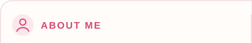 
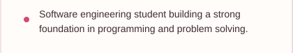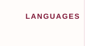<a href="https://github.com/Adelaidemhuntana/Mahube-valley-primary-school-website" title="Python project">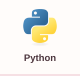</a><a href="https://github.com/Adelaidemhuntana/brownfields-robot-worlds-8-jhb-43" title="Java project">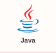</a><a href="https://github.com/Adelaidemhuntana/my-shecodes-plus-weather-final-project" title="JavaScript project">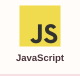</a><a href="https://github.com/Adelaidemhuntana/my-shecodes-plus-weather-final-project" title="CSS3 project">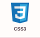</a><a href="https://github.com/Adelaidemhuntana/Mahube-valley-primary-school-website" title="SQL project">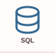</a><a href="https://github.com/Adelaidemhuntana/multi-agent-ai-course-generator" title="Bash project">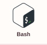</a>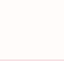 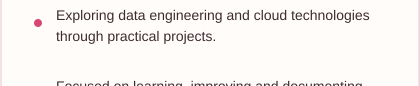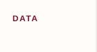<a href="https://github.com/Adelaidemhuntana/Mahube-valley-primary-school-website" title="FastAPI project">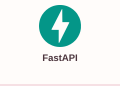</a><a href="https://github.com/Adelaidemhuntana/Mahube-valley-primary-school-website" title="Pandas project">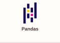</a><a href="https://github.com/Adelaidemhuntana/Mahube-valley-primary-school-website" title="PySpark project">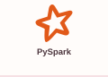</a><a href="https://github.com/Adelaidemhuntana/Mahube-valley-primary-school-website" title="SQLite project">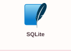</a><a href="https://github.com/Adelaidemhuntana/Mahube-valley-primary-school-website" title="Power BI project">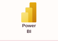</a> 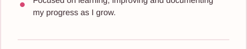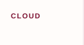<a href="https://github.com/Adelaidemhuntana/multi-agent-ai-course-generator" title="Google Cloud project">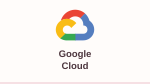</a><a href="https://github.com/Adelaidemhuntana/aws-partyrock-educare-ai-sa" title="AWS PartyRock project">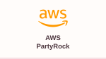</a><a href="https://github.com/Adelaidemhuntana/Mahube-valley-primary-school-website" title="Amazon S3 project">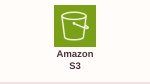</a><a href="https://github.com/Adelaidemhuntana/Mahube-valley-primary-school-website" title="Amazon RDS project">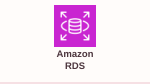</a> 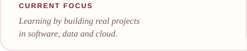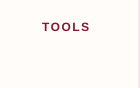<a href="https://github.com/Adelaidemhuntana/multi-agent-ai-course-generator" title="Git project">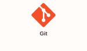</a><a href="https://github.com/Adelaidemhuntana/adelaide-portfolio" title="VS Code project">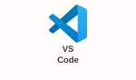</a><a href="https://github.com/Adelaidemhuntana/Adelaidemhuntana" title="GitHub project">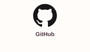</a><a href="https://github.com/Adelaidemhuntana/multi-agent-ai-course-generator" title="Docker project">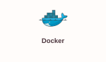</a> 

  
  
  

<h2 align="center">Featured Projects</h2>

  
  

  
  

