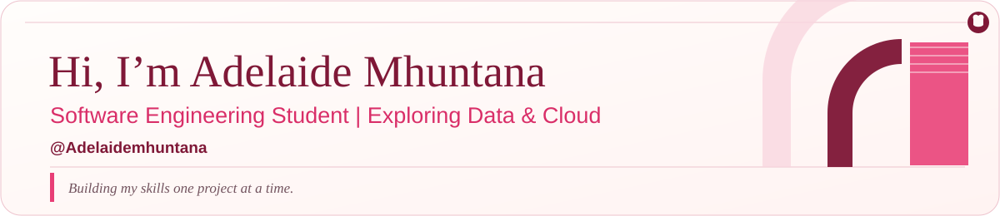
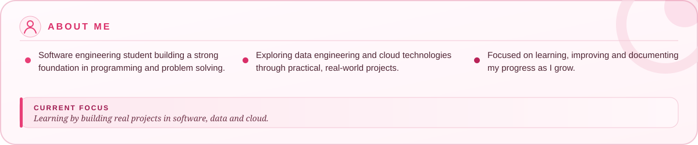
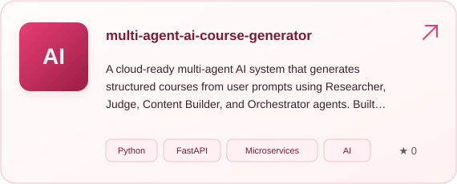
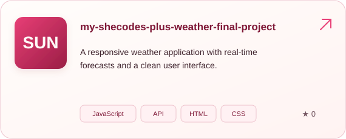
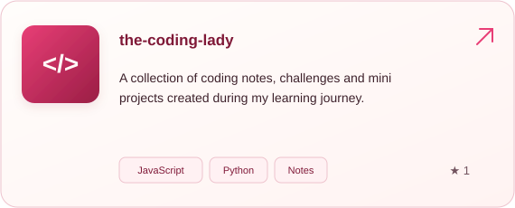
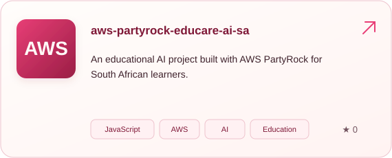

  

  

<h2 align="center">Tech Stack</h2>

Click a technology to see it used in one of my projects.

<strong>LANGUAGES</strong>

  
  
  
  
  
  

<strong>DATA</strong>

  
  
  

<strong>CLOUD</strong>

  
  

<strong>TOOLS</strong>

  
  
  

  
  
  

<h2 align="center">Featured Projects</h2>

  
  

  
  

